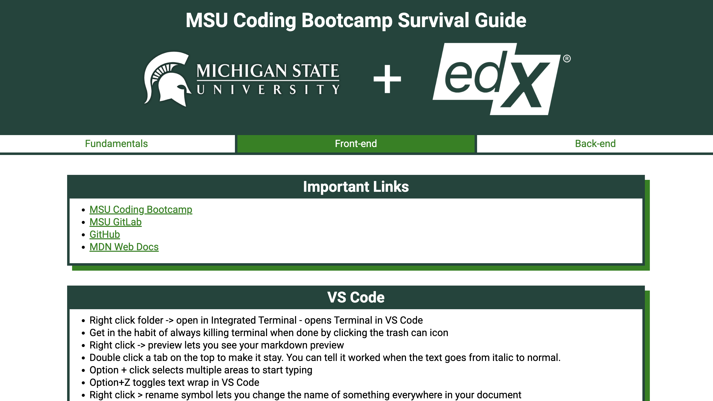

# MSU Coding Bootcamp Survival Guide
## Description
This is my MSU Coding Bootcamp Survival Guide. This webpage contains important links, notes, and references to help me learn how to code. If you're reading this, hopefully it will help you, too!

## Deployed Application
[Deployed Application Link](finntendoverse.github.io/msu-coding-bootcamp-survival-guide/)

## Installation
N/A

## Usage
To use this Prework Study Guide, you can review the notes in each section. The **Fundamentals** section contains all of the websites I will be using daily, as well as some VS Code, Github, and Terminal basics. The **Front End** section contains HTML, CSS, and JavaScript notes. The **Back End** section contains more advanced JavaScript notes, as well as node.js notes.

## Credits
I am using [Prism](https://prismjs.com/index.html) with Normalize Whitespace to create code blocks.

## License
MIT License